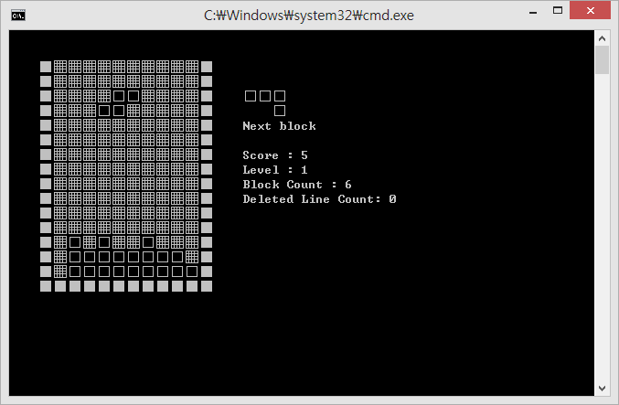

# 테트리스 게임


* 심심해서 만들어본 콘솔 텍스트 기반 테트리스.
* 처음으로 만들어 본거라 날림 소스가 있긴 하지만 원했던 기능들 모두 완벽하게 동작됨! :D

### 소스코드 구성
* block.h 파일
  * 블럭들의 모양에 따른 좌표 정보들을 정의하게 될 파일의 헤더파일
* block.cpp 파일
  * 블럭들의 모양에 따른 좌표 정보들을 정의된 파일
* Tetris.cpp 파일 (main 포함)
  * block 객체를 가지고 실제 테트리스 로직을 구현한 파일


### 게임 방법
```
블럭 이동 :   ← ↓ → 
블럭 회전 :   ↑         
블럭 드롭 :   space
```
